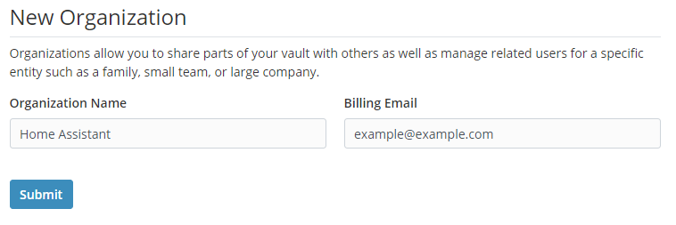
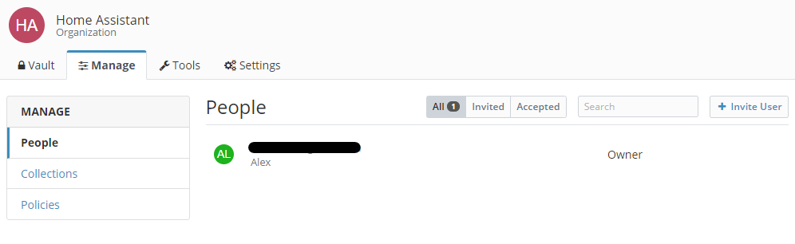
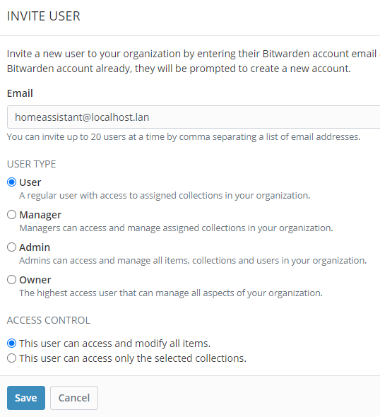
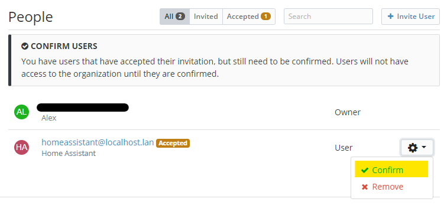
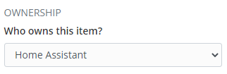

# Bitwarden secrets for Home Assistant set up

This page outlines my personal set up with [Bitwarden secrets for Home Assistant](https://alxx.nl/hassio-addons/blob/master/bitwarden-secrets/README.md).

## Bitwarden installation

You can easily install [Bitwarden RS](https://github.com/hassio-addons/addon-bitwarden) for Home Assistant from the Add-on Store. Bitwarden is a community maintained add-on available from the Home Assistant Community Add-ons repository.

## Home Assistant organization

We need to do some basic management with Bitwarden to set it up for usage with Home Assistant. This is all done through the Bitwarden web interface.

### Creating your personal user

After installing and starting the Bitwarden RS add-on, I recommend that you create your personal user. With this user you can use Bitwarden in general from any device.

### Creating a Home Assistant user

We are also going to create a Home Assistant user. This user is only needed by Home Assistant. Since we have a local Bitwarden installation I recommend setting the user id / e-mail address to: `homeassistant@localhost.lan` indicating this is a local user only.

You can use the Bitwarden password generator to generate a secure password for this user.

### Disable new registrations

When you have Bitwarden exposed to the internet (ie. through a reverse proxy like [Traefik](https://alxx.nl/hassio-addons/tree/master/traefik)) I recommend disabling new user registration after you have created all of your users. This will keep unwelcome guests out of our local install.

You can do this by browsing to the Bitwarden RS suffixed by the `/admin/` path. So for instance: 'http://192.168.0.10:7878/admin/'. To access the admin panel you will need your personal access token which can be found in the add-on log.

If the admin token isn't visible (anymore) in the Bitwarden RS log you can also retrieve it through Docker and SSH with the following command:

```bash
docker exec -it addon_a0d7b954_bitwarden cat /data/config.json | jq -r '.admin_token'
```

This will print your admin token.

> _**NOTE** This is an optional step._

### Creating a Home Assistant organization entity

Finally we are going to create a Home Assistant organization in which we can easily manage our Home Assistant secrets. 

First we are going to go to *Settings* ➡ *Organizations* and click *New Organization*. We set the *Organization Name* to **Home Assistant** and you can set anything in *Billing email*.



After creating, we go to this newly created organization and click the *Manage* tab.



We are going to invite our earlier created Home Assistant user by clicking the *➕ Invite User* tab.



> _**Note** we want this user to have access to all items!_

Finally we are going to confirm this user to have access to our Home Assistant organization. The user should automatically already have accepted the invite.



Now we are done with setting up the correct environment for Home Assistant to retrieve our secrets.

## Adding secrets

Adding secrets for use in Home Assistant is fairly trivial. You can add items through the web interface or through any of Bitwarden's apps. The only thing you should take care of is adding the item to the correct organization.



## Installing Bitwarden secrets for Home Assistant

Follow these steps to get the add-on installed on your system:

1. Navigate in your Home Assistant frontend to __Supervisor -> Add-on Store__
2. Add this new repository by URL (`https://github.com/alex3305/hassio-addons`)
3. Find the "Bitwarden secrets for Home Assistant" add-on and click it.
4. Click on the "INSTALL" button

### Configuration

Just fill in your Home Assistant Bitwarden user, password and organization name into the add-on and you are good to go.

You can also enable repeat mode, which will retrieve your secrets at every interval automatically without the need to restart the add-on.
