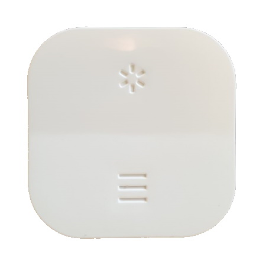

# IKEA TRÅDFRI open/close remote

## Device attributes

### Connectivity

This device is connected through Zigbee.

### Power

This device is battery powered with a **CR2023**.

#### Battery life

Unknown.

### Factory reset

Open the back of the remote and press the pairing button 4 times.

### Pairing (Phoson)

Pairing is done by factory resetting the remote. Pairing should happen automatically within Phoscon.

## Deconz events

* _1002_: Open
* _2002_: Close
